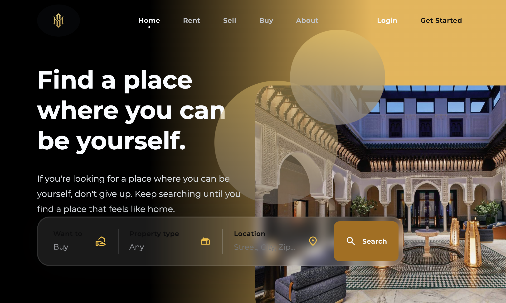
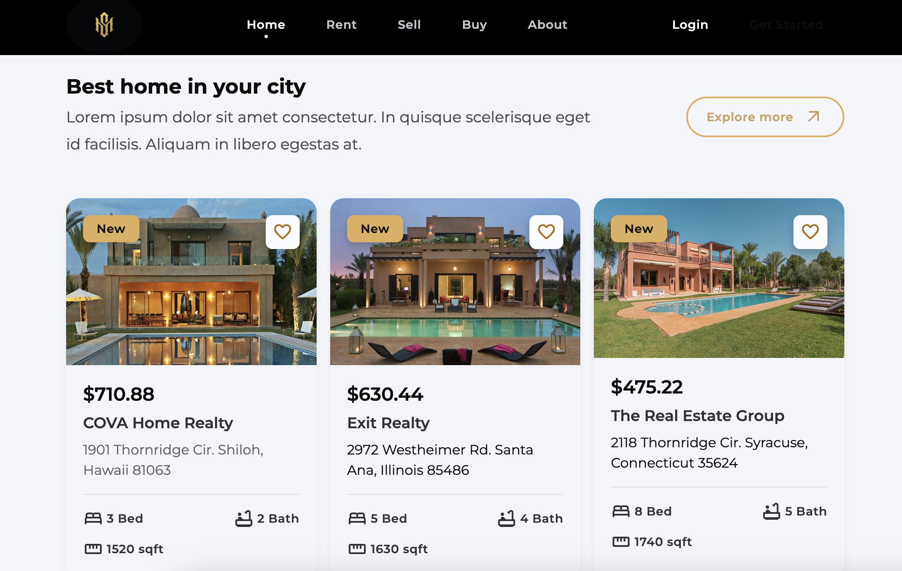

# 🏡 Real Estate Website

Welcome to the **Real Estate Website**! 🌍 This is a **responsive web site ** that allows users to **buy**, **sell**, or **rent** apartments. The platform provides powerful search filters to browse listings by city and other criteria. Plus, users can read reviews from others to make informed decisions. Built with **HTML**, **CSS**, and **JavaScript**.

---

## 🚀 Features

- **🔍 Advanced Search:** Find apartments based on location (city), price range, and more.
- **🏙️ City Filter:** Easily filter properties by city to find the perfect place.
- **📝 Reviews:** Users can read and submit reviews for properties, helping others make informed decisions.
- **📱 Responsive Design:** The website is mobile-friendly, ensuring a great experience on all devices (desktop, tablet, and phone).
- **💬 User-Friendly Interface:** A clean, easy-to-navigate layout makes browsing properties a breeze.

---

## 💻 Technologies Used

- **HTML5**: For the structure of the website.
- **CSS3**: For styling, including responsive layouts.
- **JavaScript**: For interactivity, dynamic searching, and filtering.

